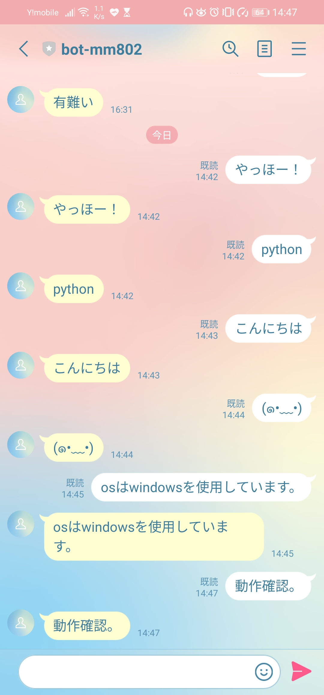

# Pythonを使ったオウム返しLINEbot
## APP概要
こちらで作成したbotチャンネルに、文字を送信するとチャンネルの方から打った文字を返信する。
## 目的
今後に向けて、LINE APIやherokuを理解する為に、試験的にLINE上で送られた文字をオウム返しするlinebotを作成する。

## 環境
Windows 11

python 3.9.10

heroku

git

##動作確認

